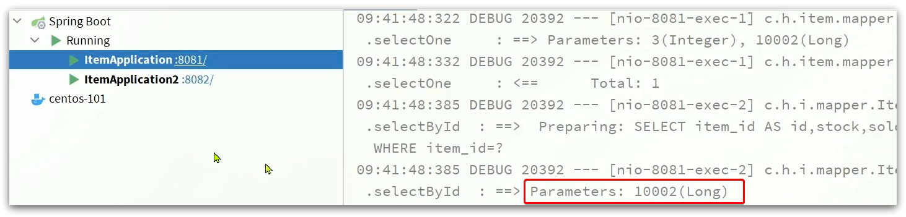
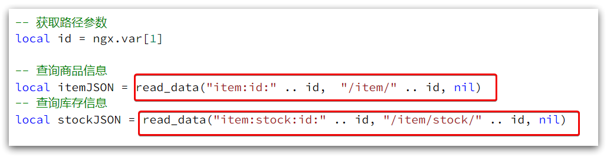
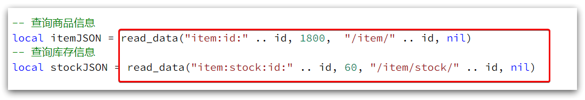

# 多级缓存

1. 传统缓存的问题：
传统的缓存策略一般是请求到达tomcat后，先查询Redis，如果未命中则查询数据库，存在下面的问题：
* 请求要经过Tomcat处理，Tomcat的性能成为整个系统的瓶颈
* Redis缓存失效时，会对数据库产生冲击

2. 多级缓存方案


## 1. JVM进程缓存
1. 分布式缓存
* 优点：存储容量大、可靠性好、集群间共享
* 缺点：访问缓存有网络开销
* 场景：缓存数据量较大、可靠性要求较高、需要在集群间共享

2. 本地进程缓存
* 优点：读取本地内存，没有网络开销，速度快
* 缺点：存储容量有限、可靠性较低、无法共享
* 场景：性能要求更高，缓存数据量小

*Caffeine*提供了三种缓存驱逐策略：
* 基于容量  ``设置缓存的数量上限``
```java
// 创建缓存对象
Cache<String, String> cache = Caffeine.newBuilder()
        .initialCapacity(100)  // 初始化为100
        .maximumSize(10000)  // 设置缓存大小上限为10000
        .build();
```
* 基于时间  ``设置缓存的有效时间``
```java
// 创建缓存对象
Cache<String, String> cache = Caffeine.newBuilder()
        .expireAfterWrite(Duration.ofSecond(10))  // 设置缓存有效期为10秒，从最后一次写入开始计时
        .build();
```
* 基于引用  ``设置缓存为软引用或弱引用，利用GC来回收缓存。性能较差，不建议使用``

## 2. Lua语法

1. 数据类型
* nil  ``表示一个无效值(在条件表达式中相当于false)``
* boolean
* number  ``表示双精度类型的实浮点数``
* string
* function  ``由C或Lua编写的函数``
* userdata  ``表示任意存储在变量中的C数据结构``
* thread  ``表示执行的独立线路，用于执行协同程序``
* table  ``Lua中的表(table)其实是一个"关联数组", 数组的索引可以是数字、字符串或表类型``

2. 变量
> local str = 'hello' .. 'world' print(str) Lua声明变量的时候，并不需要指定数据类型，..表示拼接字符串
>
> 访问数组，Lua数组的角标从1开始

3. 循环
* 遍历数组
```lua
local arr = {'java','python','lua'}
-- 遍历数组
for index,value in ipairs(arr) do
    printf(index, value)
end 
```
* 遍历table
```lua
local map = {name='Jack', age=21}
-- 遍历table
for key,value in pairs(map) do
    printf(key, value)
end 
```

4. 函数
```lua
function 函数名( argument1, argument2..., argumentn)
    -- 函数体
    return 返回值
end 
```

5. 条件控制
```lua
if(布尔表达式)
then 
    --[ 布尔表达式为true时执行的代码块 --]
else
    --[ 布尔表达式为flase时执行的代码块 --] 
end
```
* and  逻辑与操作符
* or  逻辑或操作符
* not  逻辑非操作符

## 3. 多级缓存

1. OpenResty(一个基于Nginx的高性能Web平台)

2. 请求参数处理
* 路径占位符  ``/item/1001``
```lua
# 1. 正则表达式匹配
location ~ /item/(\d+){
    content_by_lua_file lua/item.lua;
} 

-- 2. 匹配的参数会存入ngx.var数组中，可以用角标获取
local id = ngx.var[1]
```
* 请求头  ``id: 1001``
```lua
-- 获取请求头，返回值是table类型
local headers = ngx.req.get_headers()
```
* Get请求参数  ``?id=1001``
```lua
-- 获取GET请求参数，返回值是table类型
local getParams = ngx.req.get_uri_args()
```
* Post表单参数  
```lua
-- 获取请求体
ngx.req.read_body()
-- 获取POST表单参数，返回值是table类型
local postParams = ngx.req.get_post_args() 
```
* JSON参数  ``{"id": 1001}``
```lua
-- 读取请求体
ngx.req.read_body()
-- 获取body中的json数据，返回值是string类型
local jsonBody = ngx.req.get_body_data()
```

3. 发送http请求的API：
   nginx提供了内部API用以发送http请求：

```lua
local resp = ngx.location.capture("/path",{
    method = ngx.HTTP_GET,   -- 请求方式
    args = {a=1,b=2},  -- get方式传参数
})
```

返回的响应内容包括：

- resp.status：响应状态码
- resp.header：响应头，是一个table
- resp.body：响应体，就是响应数据

注意：这里的path是路径，并不包含IP和端口。这个请求会被nginx内部的server监听并处理。

但是我们希望这个请求发送到Tomcat服务器，所以还需要编写一个server来对这个路径做反向代理：

```nginx
 location /path {
     # 这里是windows电脑的ip和Java服务端口，需要确保windows防火墙处于关闭状态
     proxy_pass http://192.168.150.1:8081; 
 }
```


原理如图：


4. 封装http工具
   下面，我们封装一个发送Http请求的工具，基于ngx.location.capture来实现查询tomcat。


1）添加反向代理，到windows的Java服务

因为item-service中的接口都是/item开头，所以我们监听/item路径，代理到windows上的tomcat服务。

修改 `/usr/local/openresty/nginx/conf/nginx.conf`文件，添加一个location：

```nginx
location /item {
    proxy_pass http://192.168.150.1:8081;
}
```

以后，只要我们调用`ngx.location.capture("/item")`，就一定能发送请求到windows的tomcat服务。

2）封装工具类

之前我们说过，OpenResty启动时会加载以下两个目录中的工具文件：


所以，自定义的http工具也需要放到这个目录下。

在`/usr/local/openresty/lualib`目录下，新建一个common.lua文件：

```sh
vi /usr/local/openresty/lualib/common.lua
```
内容如下:

```lua
-- 封装函数，发送http请求，并解析响应
local function read_http(path, params)
    local resp = ngx.location.capture(path,{
        method = ngx.HTTP_GET,
        args = params,
    })
    if not resp then
        -- 记录错误信息，返回404
        ngx.log(ngx.ERR, "http请求查询失败, path: ", path , ", args: ", args)
        ngx.exit(404)
    end
    return resp.body
end
-- 将方法导出
local _M = {  
    read_http = read_http
}  
return _M
```


这个工具将read_http函数封装到_M这个table类型的变量中，并且返回，这类似于导出。

使用的时候，可以利用`require('common')`来导入该函数库，这里的common是函数库的文件名。

3）实现商品查询

最后，我们修改`/usr/local/openresty/lua/item.lua`文件，利用刚刚封装的函数库实现对tomcat的查询：

```lua
-- 引入自定义common工具模块，返回值是common中返回的 _M
local common = require("common")
-- 从 common中获取read_http这个函数
local read_http = common.read_http
-- 获取路径参数
local id = ngx.var[1]
-- 根据id查询商品
local itemJSON = read_http("/item/".. id, nil)
-- 根据id查询商品库存
local itemStockJSON = read_http("/item/stock/".. id, nil)
```

这里查询到的结果是json字符串，并且包含商品、库存两个json字符串，页面最终需要的是把两个json拼接为一个json：


这就需要我们先把JSON变为lua的table，完成数据整合后，再转为JSON。

5. CJSON工具类
   OpenResty提供了一个cjson的模块用来处理JSON的序列化和反序列化。

官方地址： https://github.com/openresty/lua-cjson/

1）引入cjson模块：

```lua
local cjson = require "cjson"
```

2）序列化：
```lua
local obj = {
    name = 'jack',
    age = 21
}
-- 把 table 序列化为 json
local json = cjson.encode(obj)
```
3）反序列化：
```lua
local json = '{"name": "jack", "age": 21}'
-- 反序列化 json为 table
local obj = cjson.decode(json);
print(obj.name)
```

6. 实现Tomcat查询
   下面，我们修改之前的item.lua中的业务，添加json处理功能：

```lua
-- 导入common函数库
local common = require('common')
local read_http = common.read_http
-- 导入cjson库
local cjson = require('cjson')

-- 获取路径参数
local id = ngx.var[1]
-- 根据id查询商品
local itemJSON = read_http("/item/".. id, nil)
-- 根据id查询商品库存
local itemStockJSON = read_http("/item/stock/".. id, nil)

-- JSON转化为lua的table
local item = cjson.decode(itemJSON)
local stock = cjson.decode(stockJSON)

-- 组合数据
item.stock = stock.stock
item.sold = stock.sold

-- 把item序列化为json 返回结果
ngx.say(cjson.encode(item))
```

7. 基于ID负载均衡
   刚才的代码中，我们的tomcat是单机部署。而实际开发中，tomcat一定是集群模式：


因此，OpenResty需要对tomcat集群做负载均衡。

而默认的负载均衡规则是轮询模式，当我们查询/item/10001时：

- 第一次会访问8081端口的tomcat服务，在该服务内部就形成了JVM进程缓存
- 第二次会访问8082端口的tomcat服务，该服务内部没有JVM缓存（因为JVM缓存无法共享），会查询数据库
- ...

因为轮询的原因，第一次查询8081形成的JVM缓存并未生效，直到下一次再次访问到8081时才可以生效，缓存命中率太低了。

怎么办？

如果能让同一个商品，每次查询时都访问同一个tomcat服务，那么JVM缓存就一定能生效了。

也就是说，我们需要根据商品id做负载均衡，而不是轮询。

#### 1）原理

nginx提供了基于请求路径做负载均衡的算法：

nginx根据请求路径做hash运算，把得到的数值对tomcat服务的数量取余，余数是几，就访问第几个服务，实现负载均衡。

例如：

- 我们的请求路径是 /item/10001
- tomcat总数为2台（8081、8082）
- 对请求路径/item/1001做hash运算求余的结果为1
- 则访问第一个tomcat服务，也就是8081

只要id不变，每次hash运算结果也不会变，那就可以保证同一个商品，一直访问同一个tomcat服务，确保JVM缓存生效。

#### 2）实现

修改`/usr/local/openresty/nginx/conf/nginx.conf`文件，实现基于ID做负载均衡。

首先，定义tomcat集群，并设置基于路径做负载均衡：

```nginx 
upstream tomcat-cluster {
    hash $request_uri;
    server 192.168.150.1:8081;
    server 192.168.150.1:8082;
}
```

然后，修改对tomcat服务的反向代理，目标指向tomcat集群：

```nginx
location /item {
    proxy_pass http://tomcat-cluster;
}
```

重新加载OpenResty

```sh
nginx -s reload
```

#### 3）测试

启动两台tomcat服务：


同时启动：


清空日志后，再次访问页面，可以看到不同id的商品，访问到了不同的tomcat服务：




8. Redis缓存预热
   1）利用Docker安装Redis
```sh
docker run --name redis -p 6379:6379 -d redis redis-server --appendonly yes
```
2）在item-service服务中引入Redis依赖
```xml
<dependency>
    <groupId>org.springframework.boot</groupId>
    <artifactId>spring-boot-starter-data-redis</artifactId>
</dependency>
```
3）配置Redis地址

```yaml
spring:
  redis:
    host: 192.168.150.101
```
4）编写初始化类

缓存预热需要在项目启动时完成，并且必须是拿到RedisTemplate之后。

这里我们利用InitializingBean接口来实现，因为InitializingBean可以在对象被Spring创建并且成员变量全部注入后执行。

```java
@Component
public class RedisHandler implements InitializingBean {

    @Autowired
    private StringRedisTemplate redisTemplate;

    @Autowired
    private IItemService itemService;
    @Autowired
    private IItemStockService stockService;

    private static final ObjectMapper MAPPER = new ObjectMapper();

    @Override
    public void afterPropertiesSet() throws Exception {
        // 初始化缓存
        // 1.查询商品信息
        List<Item> itemList = itemService.list();
        // 2.放入缓存
        for (Item item : itemList) {
            // 2.1.item序列化为JSON
            String json = MAPPER.writeValueAsString(item);
            // 2.2.存入redis
            redisTemplate.opsForValue().set("item:id:" + item.getId(), json);
        }

        // 3.查询商品库存信息
        List<ItemStock> stockList = stockService.list();
        // 4.放入缓存
        for (ItemStock stock : stockList) {
            // 2.1.item序列化为JSON
            String json = MAPPER.writeValueAsString(stock);
            // 2.2.存入redis
            redisTemplate.opsForValue().set("item:stock:id:" + stock.getId(), json);
        }
    }
}
```
9. 封装Redis工具
   OpenResty提供了操作Redis的模块，我们只要引入该模块就能直接使用。但是为了方便，我们将Redis操作封装到之前的common.lua工具库中。

修改`/usr/local/openresty/lualib/common.lua`文件：

1）引入Redis模块，并初始化Redis对象

```lua
-- 导入redis
local redis = require('resty.redis')
-- 初始化redis
local red = redis:new()
red:set_timeouts(1000, 1000, 1000)
```

2）封装函数，用来释放Redis连接，其实是放入连接池

```lua
-- 关闭redis连接的工具方法，其实是放入连接池
local function close_redis(red)
    local pool_max_idle_time = 10000 -- 连接的空闲时间，单位是毫秒
    local pool_size = 100 --连接池大小
    local ok, err = red:set_keepalive(pool_max_idle_time, pool_size)
    if not ok then
        ngx.log(ngx.ERR, "放入redis连接池失败: ", err)
    end
end
```

3）封装函数，根据key查询Redis数据

```lua
-- 查询redis的方法 ip和port是redis地址，key是查询的key
local function read_redis(ip, port, key)
    -- 获取一个连接
    local ok, err = red:connect(ip, port)
    if not ok then
        ngx.log(ngx.ERR, "连接redis失败 : ", err)
        return nil
    end
    -- 查询redis
    local resp, err = red:get(key)
    -- 查询失败处理
    if not resp then
        ngx.log(ngx.ERR, "查询Redis失败: ", err, ", key = " , key)
    end
    --得到的数据为空处理
    if resp == ngx.null then
        resp = nil
        ngx.log(ngx.ERR, "查询Redis数据为空, key = ", key)
    end
    close_redis(red)
    return resp
end
```

4）导出

```lua
-- 将方法导出
local _M = {  
    read_http = read_http,
    read_redis = read_redis
}  
return _M
```

完整的common.lua：

```lua
-- 导入redis
local redis = require('resty.redis')
-- 初始化redis
local red = redis:new()
red:set_timeouts(1000, 1000, 1000)

-- 关闭redis连接的工具方法，其实是放入连接池
local function close_redis(red)
    local pool_max_idle_time = 10000 -- 连接的空闲时间，单位是毫秒
    local pool_size = 100 --连接池大小
    local ok, err = red:set_keepalive(pool_max_idle_time, pool_size)
    if not ok then
        ngx.log(ngx.ERR, "放入redis连接池失败: ", err)
    end
end

-- 查询redis的方法 ip和port是redis地址，key是查询的key
local function read_redis(ip, port, key)
    -- 获取一个连接
    local ok, err = red:connect(ip, port)
    if not ok then
        ngx.log(ngx.ERR, "连接redis失败 : ", err)
        return nil
    end
    -- 查询redis
    local resp, err = red:get(key)
    -- 查询失败处理
    if not resp then
        ngx.log(ngx.ERR, "查询Redis失败: ", err, ", key = " , key)
    end
    --得到的数据为空处理
    if resp == ngx.null then
        resp = nil
        ngx.log(ngx.ERR, "查询Redis数据为空, key = ", key)
    end
    close_redis(red)
    return resp
end

-- 封装函数，发送http请求，并解析响应
local function read_http(path, params)
    local resp = ngx.location.capture(path,{
        method = ngx.HTTP_GET,
        args = params,
    })
    if not resp then
        -- 记录错误信息，返回404
        ngx.log(ngx.ERR, "http查询失败, path: ", path , ", args: ", args)
        ngx.exit(404)
    end
    return resp.body
end
-- 将方法导出
local _M = {  
    read_http = read_http,
    read_redis = read_redis
}  
return _M
```
10. 实现Redis查询
    接下来，我们就可以去修改item.lua文件，实现对Redis的查询了。
查询逻辑是：
- 根据id查询Redis
- 如果查询失败则继续查询Tomcat
- 将查询结果返回

1）修改`/usr/local/openresty/lua/item.lua`文件，添加一个查询函数：

```lua
-- 导入common函数库
local common = require('common')
local read_http = common.read_http
local read_redis = common.read_redis
-- 封装查询函数
function read_data(key, path, params)
    -- 查询本地缓存
    local val = read_redis("127.0.0.1", 6379, key)
    -- 判断查询结果
    if not val then
        ngx.log(ngx.ERR, "redis查询失败，尝试查询http， key: ", key)
        -- redis查询失败，去查询http
        val = read_http(path, params)
    end
    -- 返回数据
    return val
end
```

2）而后修改商品查询、库存查询的业务：



3）完整的item.lua代码：

```lua
-- 导入common函数库
local common = require('common')
local read_http = common.read_http
local read_redis = common.read_redis
-- 导入cjson库
local cjson = require('cjson')

-- 封装查询函数
function read_data(key, path, params)
    -- 查询本地缓存
    local val = read_redis("127.0.0.1", 6379, key)
    -- 判断查询结果
    if not val then
        ngx.log(ngx.ERR, "redis查询失败，尝试查询http， key: ", key)
        -- redis查询失败，去查询http
        val = read_http(path, params)
    end
    -- 返回数据
    return val
end

-- 获取路径参数
local id = ngx.var[1]

-- 查询商品信息
local itemJSON = read_data("item:id:" .. id,  "/item/" .. id, nil)
-- 查询库存信息
local stockJSON = read_data("item:stock:id:" .. id, "/item/stock/" .. id, nil)

-- JSON转化为lua的table
local item = cjson.decode(itemJSON)
local stock = cjson.decode(stockJSON)
-- 组合数据
item.stock = stock.stock
item.sold = stock.sold

-- 把item序列化为json 返回结果
ngx.say(cjson.encode(item))
```
11. Nginx本地缓存
    现在，整个多级缓存中只差最后一环，也就是nginx的本地缓存了。如图：


本地缓存API

OpenResty为Nginx提供了**shard dict**的功能，可以在nginx的多个worker之间共享数据，实现缓存功能。

1）开启共享字典，在nginx.conf的http下添加配置：

```nginx
 # 共享字典，也就是本地缓存，名称叫做：item_cache，大小150m
 lua_shared_dict item_cache 150m; 
```


2）操作共享字典：

```lua
-- 获取本地缓存对象
local item_cache = ngx.shared.item_cache
-- 存储, 指定key、value、过期时间，单位s，默认为0代表永不过期
item_cache:set('key', 'value', 1000)
-- 读取
local val = item_cache:get('key')
```


实现本地缓存查询

1）修改`/usr/local/openresty/lua/item.lua`文件，修改read_data查询函数，添加本地缓存逻辑：

```lua
-- 导入共享词典，本地缓存
local item_cache = ngx.shared.item_cache

-- 封装查询函数
function read_data(key, expire, path, params)
    -- 查询本地缓存
    local val = item_cache:get(key)
    if not val then
        ngx.log(ngx.ERR, "本地缓存查询失败，尝试查询Redis， key: ", key)
        -- 查询redis
        val = read_redis("127.0.0.1", 6379, key)
        -- 判断查询结果
        if not val then
            ngx.log(ngx.ERR, "redis查询失败，尝试查询http， key: ", key)
            -- redis查询失败，去查询http
            val = read_http(path, params)
        end
    end
    -- 查询成功，把数据写入本地缓存
    item_cache:set(key, val, expire)
    -- 返回数据
    return val
end
```

2）修改item.lua中查询商品和库存的业务，实现最新的read_data函数：



其实就是多了缓存时间参数，过期后nginx缓存会自动删除，下次访问即可更新缓存。

这里给商品基本信息设置超时时间为30分钟，库存为1分钟。

因为库存更新频率较高，如果缓存时间过长，可能与数据库差异较大。

3）完整的item.lua文件：

```lua
-- 导入common函数库
local common = require('common')
local read_http = common.read_http
local read_redis = common.read_redis
-- 导入cjson库
local cjson = require('cjson')
-- 导入共享词典，本地缓存
local item_cache = ngx.shared.item_cache

-- 封装查询函数
function read_data(key, expire, path, params)
    -- 查询本地缓存
    local val = item_cache:get(key)
    if not val then
        ngx.log(ngx.ERR, "本地缓存查询失败，尝试查询Redis， key: ", key)
        -- 查询redis
        val = read_redis("127.0.0.1", 6379, key)
        -- 判断查询结果
        if not val then
            ngx.log(ngx.ERR, "redis查询失败，尝试查询http， key: ", key)
            -- redis查询失败，去查询http
            val = read_http(path, params)
        end
    end
    -- 查询成功，把数据写入本地缓存
    item_cache:set(key, val, expire)
    -- 返回数据
    return val
end

-- 获取路径参数
local id = ngx.var[1]

-- 查询商品信息
local itemJSON = read_data("item:id:" .. id, 1800,  "/item/" .. id, nil)
-- 查询库存信息
local stockJSON = read_data("item:stock:id:" .. id, 60, "/item/stock/" .. id, nil)

-- JSON转化为lua的table
local item = cjson.decode(itemJSON)
local stock = cjson.decode(stockJSON)
-- 组合数据
item.stock = stock.stock
item.sold = stock.sold

-- 把item序列化为json 返回结果
ngx.say(cjson.encode(item))
```

## 4. 缓存同步策略

缓存数据同步的常见方式有三种：

**设置有效期**：给缓存设置有效期，到期后自动删除。再次查询时更新

- 优势：简单、方便
- 缺点：时效性差，缓存过期之前可能不一致
- 场景：更新频率较低，时效性要求低的业务

**同步双写**：在修改数据库的同时，直接修改缓存

- 优势：时效性强，缓存与数据库强一致
- 缺点：有代码侵入，耦合度高；
- 场景：对一致性、时效性要求较高的缓存数据

**异步通知：**修改数据库时发送事件通知，相关服务监听到通知后修改缓存数据

- 优势：低耦合，可以同时通知多个缓存服务
- 缺点：时效性一般，可能存在中间不一致状态
- 场景：时效性要求一般，有多个服务需要同步

而异步实现又可以基于MQ或者Canal来实现：

1）基于MQ的异步通知：


解读：

- 商品服务完成对数据的修改后，只需要发送一条消息到MQ中。
- 缓存服务监听MQ消息，然后完成对缓存的更新

依然有少量的代码侵入。

2）基于Canal的通知


解读：

- 商品服务完成商品修改后，业务直接结束，没有任何代码侵入
- Canal监听MySQL变化，当发现变化后，立即通知缓存服务
- 缓存服务接收到canal通知，更新缓存

代码零侵入

## 5. Canal
Canal是基于mysql的主从同步来实现的，MySQL主从同步的原理如下：


- 1）MySQL master 将数据变更写入二进制日志( binary log），其中记录的数据叫做binary log events
- 2）MySQL slave 将 master 的 binary log events拷贝到它的中继日志(relay log)
- 3）MySQL slave 重放 relay log 中事件，将数据变更反映它自己的数据


而Canal就是把自己伪装成MySQL的一个slave节点，从而监听master的binary log变化。再把得到的变化信息通知给Canal的客户端，进而完成对其它数据库的同步。


### 5.1 安装Canal

### 5.2 监听Canal
Canal提供了各种语言的客户端，当Canal监听到binlog变化时，会通知Canal的客户端。


我们可以利用Canal提供的Java客户端，监听Canal通知消息。当收到变化的消息时，完成对缓存的更新。

不过这里使用GitHub上的第三方开源的canal-starter客户端。地址：https://github.com/NormanGyllenhaal/canal-client

与SpringBoot完美整合，自动装配，比官方客户端要简单好用很多。

1. 引入依赖
```xml
<dependency>
    <groupId>top.javatool</groupId>
    <artifactId>canal-spring-boot-starter</artifactId>
    <version>1.2.1-RELEASE</version>
</dependency>
```
2. 编写配置
```yaml
canal:
  destination: xiaoyi # canal的集群名字，要与安装canal时设置的名称一致
  server: 192.168.150.101:11111 # canal服务地址
```
3. 修改Item实体类
   通过@Id、@Column、等注解完成Item与数据库表字段的映射：
```java
@Data
@TableName("tb_item")
public class Item {
    @TableId(type = IdType.AUTO)
    @Id
    private Long id;//商品id
    @Column(name = "name")
    private String name;//商品名称
    private String title;//商品标题
    private Long price;//价格（分）
    private String image;//商品图片
    private String category;//分类名称
    private String brand;//品牌名称
    private String spec;//规格
    private Integer status;//商品状态 1-正常，2-下架
    private Date createTime;//创建时间
    private Date updateTime;//更新时间
    @TableField(exist = false)
    @Transient
    private Integer stock;
    @TableField(exist = false)
    @Transient
    private Integer sold;
}
```

4. 编写监听器
   通过实现`EntryHandler<T>`接口编写监听器，监听Canal消息。注意两点：

- 实现类通过`@CanalTable("tb_item")`指定监听的表信息
- EntryHandler的泛型是与表对应的实体类

```java
@CanalTable("tb_item")
@Component
public class ItemHandler implements EntryHandler<Item> {

    @Autowired
    private RedisHandler redisHandler;
    @Autowired
    private Cache<Long, Item> itemCache;

    @Override
    public void insert(Item item) {
        // 写数据到JVM进程缓存
        itemCache.put(item.getId(), item);
        // 写数据到redis
        redisHandler.saveItem(item);
    }

    @Override
    public void update(Item before, Item after) {
        // 写数据到JVM进程缓存
        itemCache.put(after.getId(), after);
        // 写数据到redis
        redisHandler.saveItem(after);
    }

    @Override
    public void delete(Item item) {
        // 删除数据到JVM进程缓存
        itemCache.invalidate(item.getId());
        // 删除数据到redis
        redisHandler.deleteItemById(item.getId());
    }
}
```
在这里对Redis的操作都封装到了RedisHandler这个对象中，是我们之前做缓存预热时编写的一个类，内容如下：

```java
@Component
public class RedisHandler implements InitializingBean {

    @Autowired
    private StringRedisTemplate redisTemplate;

    @Autowired
    private IItemService itemService;
    @Autowired
    private IItemStockService stockService;

    private static final ObjectMapper MAPPER = new ObjectMapper();

    @Override
    public void afterPropertiesSet() throws Exception {
        // 初始化缓存
        // 1.查询商品信息
        List<Item> itemList = itemService.list();
        // 2.放入缓存
        for (Item item : itemList) {
            // 2.1.item序列化为JSON
            String json = MAPPER.writeValueAsString(item);
            // 2.2.存入redis
            redisTemplate.opsForValue().set("item:id:" + item.getId(), json);
        }

        // 3.查询商品库存信息
        List<ItemStock> stockList = stockService.list();
        // 4.放入缓存
        for (ItemStock stock : stockList) {
            // 2.1.item序列化为JSON
            String json = MAPPER.writeValueAsString(stock);
            // 2.2.存入redis
            redisTemplate.opsForValue().set("item:stock:id:" + stock.getId(), json);
        }
    }

    public void saveItem(Item item) {
        try {
            String json = MAPPER.writeValueAsString(item);
            redisTemplate.opsForValue().set("item:id:" + item.getId(), json);
        } catch (JsonProcessingException e) {
            throw new RuntimeException(e);
        }
    }

    public void deleteItemById(Long id) {
        redisTemplate.delete("item:id:" + id);
    }
}
```